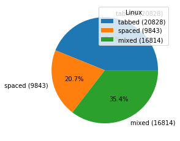
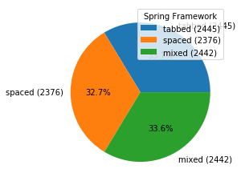
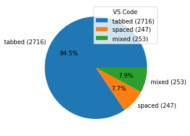

# Tab vs Space

One of the most cruical question in computer programming is to choose the proper indentation character.
This Python tool won't answer give the ultimate answer to this serious question, but it can help you to analyze indent statistics in open source projects.

# Results

|      |  |       |
|    |        |                        |
|  |        |                 |
